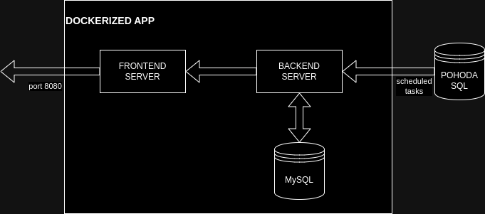

# InventoryMonitor

InventoryMonitor is a simple inventory management system that helps you keep track of orders and inventory levels.

How it could work:



## Features

- TBA

## Getting Started

Please note you must have installed `Docker` and `docker-compose` utility on your machine.

Clone this repository:

```bash
git clone https://github.com/dp9898CZ/order-stock-monitor.git
```

Run `docker-compose` to build project:

```bash
docker-compose
```
